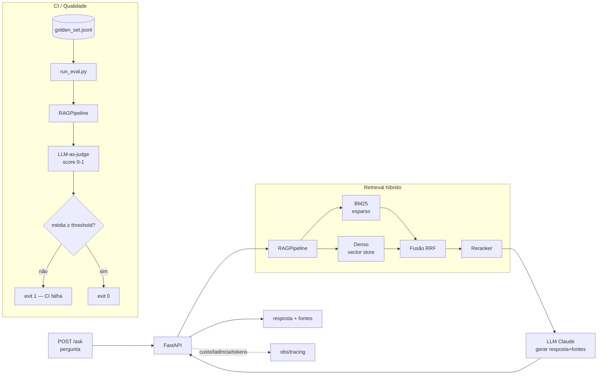

# COPOM RAG Service — RAG sobre Atas do Copom + Focus, servido como API

[](CLAUDE.md)
[](https://www.python.org/)
[](https://fastapi.tiangolo.com/)
[](LICENSE)

Serviço de **RAG (Retrieval-Augmented Generation)** sobre as **atas do Comitê de
Política Monetária (Copom)** e o **boletim Focus** do Banco Central do Brasil,
exposto como **API** (FastAPI + Docker). Pergunte em linguagem natural sobre
política monetária brasileira e receba uma resposta fundamentada, **com as fontes
citadas**.

> **Projeto em desenvolvimento.** O esqueleto é rodável (imports corretos,
> contratos definidos), mas retrieval e chamadas ao LLM estão marcados como
> `TODO` explícitos. Ver [CLAUDE.md](CLAUDE.md).

---

## Tese central

Um RAG de política monetária não se prova por uma demo bonita — prova-se por
**não regredir**. O diferencial deste projeto não é o retrieval em si, e sim a
**engenharia ao redor**:

1. **Eval harness** — golden set de perguntas reais sobre o Copom + **LLM-as-judge**
   + um **gate de CI que falha (exit 1)** se a qualidade média cair abaixo de um
   threshold. Este é o **código-âncora**.
2. **Observability** — custo, latência e tokens medidos **por request**.
3. **API + Docker** — `POST /ask` empacotado para subir com um comando.

---

## Metodologia — CRISP-DM

| Fase | Aplicação |
|---|---|
| **Entendimento do Negócio** | Responder perguntas sobre política monetária com fundamentação auditável (fontes citadas) e sem alucinação numérica |
| **Entendimento dos Dados** | Atas do Copom (API BCB) + boletim Focus; textos com jargão de política monetária e números sensíveis (Selic, metas, projeções) |
| **Preparação dos Dados** | Chunking das atas/Focus, indexação esparsa (BM25) e densa (embeddings) em vector store |
| **Modelagem** | Retrieval híbrido BM25 + denso com reranking → prompt → geração via Claude, com saída estruturada (resposta + fontes) |
| **Avaliação** | **Eval harness**: golden set + LLM-as-judge (score 0–1 + rationale) + gate de CI que reprova regressão de qualidade |
| **Implantação** | API FastAPI + Docker/compose; observability de custo/latência/tokens por request |

---

## Arquitetura



---

## Estrutura do Projeto

```
COPOM_RAG_Service/
├── src/
│   ├── app/main.py            # FastAPI, endpoint POST /ask (stub)
│   ├── rag/
│   │   ├── retriever.py       # BM25 + denso + reranking (stubs de classe)
│   │   └── pipeline.py        # orquestra retrieve → prompt → gerar (stub)
│   ├── eval/
│   │   ├── golden_set.jsonl   # 8 perguntas reais sobre o Copom + gabarito
│   │   ├── judge.py           # LLM-as-judge → score [0,1] + rationale (Pydantic)
│   │   └── run_eval.py        # CORAÇÃO: roda golden set, agrega, gate exit 1
│   └── obs/tracing.py         # context manager de custo/latência/tokens
├── portfolio/
│   └── copom-rag-service.qmd  # ficha CRISP-DM (divulgação)
├── Dockerfile
├── docker-compose.yml
├── requirements.txt
├── .env.example
└── CLAUDE.md
```

---

## Como rodar

### Pré-requisitos

- Python 3.11+
- Chave de API da Anthropic
- Docker (opcional, para subir via compose)

### Instalação

```bash
git clone https://github.com/vitorwilher/copom-rag-service.git
cd copom-rag-service

python3 -m venv .venv
source .venv/bin/activate
pip install -r requirements.txt

cp .env.example .env   # edite com sua ANTHROPIC_API_KEY
```

### Subir a API

```bash
cd src
uvicorn app.main:app --reload --port 8000
# POST http://localhost:8000/ask   {"question": "..."}
```

### Rodar o eval harness (o gate)

```bash
cd src
python -m eval.run_eval                  # threshold padrão (0.70)
python -m eval.run_eval --threshold 0.75
# exit code 1 se a média dos scores < threshold  → falha o CI
```

### Docker

```bash
docker compose up --build
```

---

## Roadmap

1. **Ingestão** — coletar e chunkar atas do Copom (API BCB) e o Focus; indexar em BM25 + vector store.
2. **Retrieval real** — implementar BM25, denso e fusão RRF + reranking (`src/rag/retriever.py`).
3. **Geração** — conectar o Claude no pipeline com saída estruturada (resposta + fontes).
4. **LLM-as-judge real** — chamada ao Claude com schema Pydantic (`src/eval/judge.py`).
5. **CI** — GitHub Action rodando `run_eval` a cada PR, bloqueando merge em regressão.
6. **Observability** — exportar métricas do tracing para backend (OTel/Langfuse/Prometheus).
7. **Golden set** — expandir para 30–50 perguntas, incluindo casos adversariais e de abstenção.

---

## Tecnologias

| Camada | Tecnologia |
|---|---|
| **API** | FastAPI + uvicorn |
| **Contratos** | Pydantic v2 |
| **Retrieval esparso** | `rank-bm25` |
| **Retrieval denso** | ChromaDB (ou pgvector) |
| **LLM** | Anthropic Claude (geração + juiz) |
| **Observability** | context manager próprio (`obs/tracing.py`) |
| **Testes / CI** | pytest |
| **Empacotamento** | Docker + docker-compose |

---

Autor: **Vítor Wilher** · Análise Macro.
